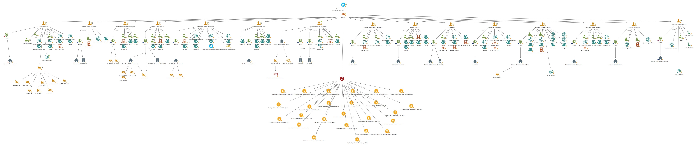

# Conti-Clear
## Extracted data &amp; informations from the Conti &amp; TrickBot leaks.
<p align="center">
  
</p>

# The beginning

Well, Since [Tob Trick](https://twitter.com/trickleaks) started leaking Conti chats and conversations, most of people started translating them using translators like [Deepl](https://www.deepl.com/en/translator) or [Google Translate](https://translate.google.com/)

You can find the original + transalted chats of the Conti TrickBot Leaks here : [conti-leaks-englished](https://github.com/TheParmak/conti-leaks-englished) 


After that, **Soufiane Tahiri** made a maltego file where he gathered the information shared by [Tob Trick](https://twitter.com/trickleaks) like **Name/Phone Number/Social networks....**


So yeah, I'm here now to share more to the story and show what I discoverd and what's on the leaked chats.


## The Maltego File


The maltego file now is more much bigger and more detailed, thanks to [Soufiane Tahiri](https://github.com/soufianetahiri). 


I'll do a pull request and keep the maltego file updated as soon as I discover new things about the leak.

## What's Added to the maltego file

- Added Allen Member
- BTC Wallets
- More Aliases
- Websites Used for operations
- Servers Used for operations
- Malware templates & scans
- GPG keys used on emails
- IP Adresses used to log to hosting services
- Fake names used to buy VPS on multiple websites.

# Discovery

## Members List : 

1. Anton Alexandrovich Bragin - (hector)
2. Cherepanov Andrey Andreevich - (basil, fast, faster)
3. Galochkin Maxim Sergeevich - (bentley)
4. Grigoriev Daniil Olegovich - (fire, geralemur, skippy, lemur)
5. Kiselyov Dmitry Sergeevich - (allen)
6. Korneyev Roman Viktorovych - (liam)
7. Mikhailov Maxim Sergeevich - (baget, MaxMS76, vnc)
8. Mozhaev Alexander Vyacheslavovich - (green, rocco)
9. Osipov Oleg Vasylevych -  (frog, geraldo)
10. Polyak Valerievich - (cypher)
11. Sergey Loguntsov - (zulas)
12. Tesman Georgy Sergeevich - (core, egor)
13. Vakhromeev Ivan - (mushroom, royal)
14. Valery Sedletski - (strix, valerius)
15. Valiakhmetov Vadym Firdavysovych - (weldon, Vasm, VadimVdx, mentos)

## Notes : ( 07/03/2022 ) 

- Most of the files ( mostly malware templates ) were shared through [file.io](http://file.io),[http://send.firefox.com](send.firefox.com) and [http://qaz.im](qaz.im)
- Most of the malware scans were done using [Avcheck.net](http://Avcheck.net) and [dyncheck.com](http://dyncheck.com)
- They used [privnote.com](http://privnote.com) to share private/sensitive notes.
- **Multiple login credentials to the websites they used for operations and fishing are still working...**
- Documents explaining the fishing process, what and how to send emails to the targets ( mostly in Russian )


## Malware Scans (07/03/2022)

-   https://avcheck.net/id/JcskuAwsn4Lq

-   https://avcheck.net/id/ZaTNn5wir3BI

-   https://avcheck.net/id/rFnYuyVLtKmU > **l_dll_rndll_y_64_p2_g5_v197_20_12_21_logs_no.dll**


-   https://avcheck.net/id/rLadnV8zo4Sz > **loader_exe_64_audi.exe.crypted_1.exe (172 kb)**


-   https://avcheck.net/id/kDOy62MKsr6L > **dll_64_prj_Astro4.dll (6 kb)**


-   https://avcheck.net/id/XChz10tc6swL > **dll_64_prj_Astro4.dll**


-   https://avcheck.net/id/ANJMNv3RwYUy > **fe92bf5171a1c7accda0d3ac4e47ad38669232f1.exe**

-   https://avcheck.net/id/oTLAJkt2Keqk > **loader_dll_64_donat4_150199_1.dll**


## Used Websites : 

``` 
I didn't share the websites with correct credentials to prevent any kind of issues....
```

-   [tuta.io](http://tuta.io)

-   [ebeautytrade.com](https://ebeautytrade.com)

    -  [ebeautytrade.com/calc.exe](https://ebeautytrade.com/calc.exe)

-   [greenmountains.ae](https://greenmountains.ae)

    - [greenmountains.ae/YAS42.exe](https://greenmountains.ae/YAS42.exe)

-   [polusweb.com](https://polusweb.com)
 
-   [copyrightlive-ksa.com](https://copyrightlive-ksa.com)

    - [copyrightlive-ksa.com/Preview_Report.exe](https://copyrightlive-ksa.com/Preview_Report.exe)


-   [nutritionprofbob.com](https://nutritionprofbob.com)

    - [nutritionprofbob.com/DocumentPreview.exe](https://nutritionprofbob.com/DocumentPreview.exe)

-   [violinstop.com](https://violinstop.com)

    - [violinstop.com/DocumentPreview.exe](https://violinstop.com/DocumentPreview.exe)


## Used Servers :

-   62.108.35.194
-   134.255.254.50
-   23.239.84.136
-   46.17.107.111
-   185.68.93.33
-   212.80.219.191
-   23.239.84.132
-   194.5.249.126
-   51.89.177.5
-   104.161.32.103
-   107.155.137.7
-   37.220.6.119
-   91.235.129.110
-   62.108.35.194
-   45.141.103.194
-   51.83.172.107
-   85.143.223.16
-   194.156.98.215
-   46.249.32.16
-   212.129.41.246
-   37.120.140.177

### Examples : 

-   https://185.202.174.7:10000/
-   https://173.232.146.236/phpvirtualbox/
-   http://212.129.41.246:8090/


## GPG Keys (check the maltego file):  

### Example 

```
-----BEGIN PGP PUBLIC KEY BLOCK-----

mQINBGDAi8YBEACxfI+Yd4CiA4H5hPHkEnmiDGSvL2nl1Q2UqiLYQ66xkplKFQTO
+D2Xhgr6rPgVz7WFVn20nN4l4+gMGNqh7Z7Vgy8jFEThk6R+Ylp2uxODMcMHJnVr
q5ySrS1OIFkmqqwIbXuqxcOcTStPFI8sUlZLWQRRpRw6ACopjPfRSNQ3cFEPSLrG6n
+7omS+yMafn08unpIxXrd6g1ZcYeFB//6h1PZ3uUPrvK/ONvLZJSmxGjEFcD36Q8
jgsaXxAQyvyDUn8JpsN+9tXnDEAG8WOySNAUMtX0HNLptmlBeq4a2zo0Dp0I1xyh
v3uIKFkWsiKrr9ZYfRho60HP2UcE+ynpNo2UZTf0YhRO58bueU+9TP0KUoLUImJ4
4lA+fKInOPE3BbJY+rczocsphGYFYFYlT2Vyc12Z0pqH9/4wjs9ZEEbK0Q6R6d6eUR
lCocFHCIiI1ciePZdDz5jdm9AzsGT95dWzzAoWccsRxFuP0mx6IgHT5sdBNBqOF
Zvkvnwou19dlTcmnJZqjxMvlxjKBW2rn7kT6GDOxlaYeWd8b03Mqz2T4s+ElwU7
xzOcRLC3DAQwVm9DlvdGGe9mjkcogJSTx/J7wLg5DXa3uDc3qtr39F+4nrnG3jFi
V2R2adPc78YQlRcdz2kDyzgErNB+QWKpqPHJbKUwyciBGnVGRlqHLvt2UwARAQAB
tAVhbGxlbokCTgQTAQgAOBYhBG8ACaB7u52KrILLtm/urtO8DUwbBQJgwIvGAhsj
BQsJCAcCBhUKCQgLAgQWAgMBAh4BAheAAoJEG/urtO8DUwbM0gP/A55oIfNR4Jx
xk1wTnU92k3pAZ5xrXrBGl7I4C6l4smrJq+QnBqDuBhOrKNFIcqIs2MjNdJFFQFlR
i9kpfinj8xWSxfUsUsNo9k4VD8YzJQTW/i1cNH6g/v+932g4S3MteanHOzfl7AHrDf
W6XZYIU+3f9GamuyVMR0ZUyeVx3ZnvH3tYQ1hPYd7MRl0b6vCZtbwSN7uuFoBl6H
/7MqwfCTURbub2bapuig51FJXjER/aJPl1JEhOLDUx3RgeS63eAiCfsfNQ+D4FhO
CqgTOFqveLTjBQmcNo/Wrl2lRiX1Sjp4SF2q0taZ/QXOn2AKmHB2qYsr2EmNxAy5
1uLKeLPeHFagH8SFgb1XdkG0/CBAVU73O1mJ/7HgedHtmzPIXCmVekVMUoszc1fn
gqCx8vfK65m0brX73xjDatnR+ALZSYMxryaHXzu+edZOQ8RGcuUy0JecZOVvFDSJ
88qy8DxrM+Xz4P+R1C5jA/KeG7QrsR6AZhcprUbyRQdJwQYy/sijrT4QCbw9uJ8+
NYR7GXMIDVQb/viI3RuNHOWr3kvvHH+QfxQOn51qMSIOj4oYKUQ/sLSD6OSp6k5y
RSSu5qmDvN7w8bFkQfRSiqZdJ1cekRm3VoGyQnSr8cJGLnSHRvcUoW8agsCKEvQI
GCiFBgJitDC5POOLpongXTryQiAxizlcuQINGDAi8YBEADfJua6wMrBSQh5b3Vv
hAn0n1M8IwXATt2A70mDyhigWRJ2APYzYsvEFG1ktIDJ/Tm0cumCON8UlVbNA7LM
E9YHR0zUn7x4BIkAYnoM/KRxRNc+2XmMofTHy3Dka6w5Nh+U+m03+eopXL619JBU
GM5n4Nga1RmU4x1tVACC/pVyl9hv9SAuKByhCnOieP8LL7/qJ3YPQ08dYuhMRLPt
X/6RquYlYezj+dvFC6HT+gPAvlPhwztnfBhe/YtudbVtuea9atBuJglJg6yYQqqBy
OUrpsquCVKgED/3/q0aD2Fg5q6vak5454leQSJ6bi5BDE2+i2S46fCVbsy+Ssr7C
uiGXxaIwXPcurZ8pyBdxzc4E0gmSsB30gB9YzDpku1Xkbx8GrI/P3OIUITvcCvVk
H71gVZpK71X/iGtbrMI/3FiXo3k41UAUYZvKFhWrCW/nEK+ZBn4uIsuekzTbnOOV
3Pw7xDybSh8DDcledlxwEhl9RjvnW+Y9KNj+HAUMMLDhyruFqdmuvBCfud7nv6OT
X6dajrlg9n0QS3MF9km1DFkTYuYuMNPdZRp+xwHQ2NAI0hpmtnHbCEdQnWV5SZ8MB
sQZNpsZq2bTbr/EyS1M0wHbJUwp16T93vxV6v8R0jRvYsOZo6EAdmUsaUHs1BvnF
Cdcod8auJkmKg0KMtd8lcdkMMQARAQABiQI2BBgBCAAgFiEEbwAJoHu7nYqsgsu2
b+6u07wNTBsFAmDAi8YCGwwACgkQb+6u07wNTBuSpA/+NcxhiR9keMo31ZOWs9ru
VlP+YB3cWOCOj8vwEIEA2MljSSjh0AZ9nJwzcXL67L94Hg9JW7RXN/FEdihM4p+Z
+hWN9u337NJsa50P0GPv32wOvRLu5jq0VjwLHgk/LGZzTR1Ghep9XWsmsnL2Ntz4
bC/9QAOUn4tRho0M47v+ZBjQ2oR9LuJobAoU/Wn6upZ+n0X3azhqHrYt5OMRFF3K
DY/FVOeC320VyXI/fsCRfD5/GFpQ1p7icaIGgZSHHVdaGmBRcnySKBRLtqtCW0eJ
Mh7/DuKXLpKvLkP5hAn5/uHXA5Vm5ej/hciFUIMkHi4Ldg5MrIVapchBvqHmsSGZ
5fZp49tGiwzRzcwZ2AhIptLmWJMHVcL+i1hg8pdHbHNTTXM0iUO9yQ1XCX4qoM6I
PxEYuSMPaCvXO5qMZKQS4rPXcsOEvtUu/Z7hyyqBK9P3ZiD3JlqYc+xkyUG0VYmgY
W/mZDXc3WZnuROxIi6sYNgR0m7XuTkMVQTk5OIoCawc5N32yfA0kvaHmj7kF13nt
SH/7PTzsxTJ0TebsiTVAhO++1vLOif5rezkYvidjLu+Pf48eqsxEbnJv4SsrwACL
qOhbn6/zHxABBgoSUGdjA3Bt1ZiFDueI9AQPyJ+XmZTbjPXTgnZ52daNzC+y0MN5
L6DZhvMAHzSqKBZ2XpkNa1Q=
=fgEX
-----END PGP PUBLIC KEY BLOCK-----
```

## Screenshots 

Screenshots that contains users info like time zone, used OS, Used browser,Technologies used, Language...

Of course I saved the screenshots with the exact date,hour, and seconds on the conversations.

### Example : 


## Hosting websites 

The ones they used to buy their VPS's 


## VPS Credentials 


## Fake names used for buying VPS's


## And finally, IP logs from hosting websites logins 


I'll keep updating this Github repo as soon as I find or discover new things.


# The new maltego file : 

You can check the new file on [Soufiane Tahiri's Repo](https://github.com/soufianetahiri/Trickbotleaks).

It'll look like this : 



## You can also download a pdf report & .csv sheet table.

#### PDF


#### CSV 


# Thanks 

-   [**Soufiane Tahiri**](https://twitter.com/S0ufi4n3)  - for the Maltego file.
-   [**Tob Trick**](https://twitter.com/trickleaks) - For the Chat Leaks.
-   [**heParmak**](https://github.com/TheParmak) - For Translating the chats.

© 2022 - Sofiane Hamlaooui - Making the world a better place earth_americas
